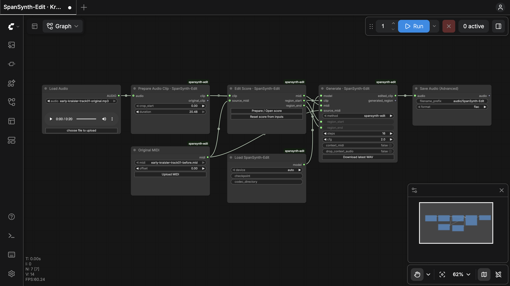

# SpanSynth-Edit for ComfyUI

Edit notes in a recording, then generate the revised audio. The **Kraisler example includes audio and MIDI** — just open it and start editing.

## 1. Open the example

<details>
<summary><strong>First time? Install ComfyUI + SpanSynth-Edit</strong></summary>

Requires [Git](https://git-scm.com/downloads), [Conda / Miniforge](https://github.com/conda-forge/miniforge#install), and an Apple Silicon Mac or [supported NVIDIA GPU](../README.md#system-requirements). Open **Terminal**. For a remote server, first connect with `ssh USER@SERVER`.

```bash
conda create -n spansynth-edit-comfyui python=3.12 -y
conda activate spansynth-edit-comfyui
cd ~
git clone --depth 1 --branch v0.37.0 https://github.com/Comfy-Org/ComfyUI.git
cd ComfyUI
```

**NVIDIA server only:** install CUDA PyTorch first. Skip this command on Mac.

```bash
python -m pip install torch torchvision torchaudio --extra-index-url https://download.pytorch.org/whl/cu130
```

Then, on either system:

```bash
python -m pip install -r requirements.txt
git clone --depth 1 --filter=blob:none --sparse https://github.com/mimbres/spansynth-edit.git custom_nodes/spansynth-edit
git -C custom_nodes/spansynth-edit sparse-checkout set spansynth app comfyui
python -m pip install './custom_nodes/spansynth-edit[comfyui]'
```

Installation downloads several packages and can take a while. These commands use `~/ComfyUI`; adjust that path if needed. On managed servers, keep ComfyUI, its environment, and the `HF_HOME` cache in project storage. [Other systems](https://docs.comfy.org/installation/manual_install).

</details>

**Start ComfyUI** in Terminal:

```bash
conda activate spansynth-edit-comfyui
cd ~/ComfyUI
python main.py --listen 127.0.0.1 --port 8188
```

Keep Terminal open, then **[open the Kraisler example](http://127.0.0.1:8188/?spansynth=example)**. Audio, MIDI, and the piano roll load automatically. No JSON import or transcription is needed.

<details>
<summary><strong>Using a remote GPU server instead?</strong></summary>

ComfyUI runs on the server; you use your laptop's browser. In a **new laptop Terminal**, connect (replace `USER@SERVER` with your SSH login):

```bash
ssh -L 8189:127.0.0.1:8188 USER@SERVER
```

Then start ComfyUI **on the server**, in the same terminal:

```bash
conda activate spansynth-edit-comfyui
cd ~/ComfyUI
python main.py --listen 127.0.0.1 --port 8188 --disable-auto-launch
```

Keep SSH open and **[open the remote example](http://127.0.0.1:8189/?spansynth=example)** on your laptop. Uploads go to the server; downloads return to your laptop.

</details>



Close the piano roll to see this workflow. **Prepare / Open score** returns to editing.

## 2. Edit → generate → listen

1. **Edit:** select a **Track**, then drag a note or use **Pencil**. **Play audio** plays the recording; **Preview notes** plays the MIDI.
2. **Generate:** click **Apply edits**, wait for “Edits saved in workflow”, then **Close** → ComfyUI's blue **Run** button.
3. **Listen:** click **Prepare / Open score** in the **Edit Score** box, then select **Generated** beside Audio.
4. **Save:** use **Download audio** and **Download MIDI** in the editor. Repeat from step 1 to keep editing.

Keep defaults: **auto** device, **16** steps, **CFG 2.0**. The edit region follows your changed notes. Weights download on first generation, so allow extra time for that run.

**Stop:** press **Ctrl+C** in Terminal. Next time, run the three start commands and reopen the example link.

<details>
<summary><strong>Use your own audio or MIDI</strong></summary>

ComfyUI's connected boxes are called **nodes**.

- **Audio + MIDI:** upload in **Load Audio** and **Original MIDI**. Choose up to 20.48 seconds in **Prepare Audio Clip**, then click **Reset score from inputs** in **Edit Score**.
- **Audio only:** replace the MIDI node with **Transcribe with YourMT3+** from the node menu. Connect **Prepare Audio Clip → clip** to it, then its MIDI output to both `source_midi` inputs. **Reset score from inputs** starts transcription on the YourMT3+ HF Space.
- **FlowEdit:** choose **spansynth-edit + flowedit** in **Generate** with original MIDI connected.

</details>

<details>
<summary><strong>Save a project · reopen an example · troubleshooting</strong></summary>

- **Keep editing later:** save the workflow from ComfyUI's menu and retain your input files. Each generation uses the original recording. Audio also saves to `ComfyUI/output/audio` on the computer running ComfyUI.
- **Fresh example:** top-left ComfyUI menu → **SpanSynth-Edit → Open Kraisler example**. Existing work stays in its own tab.
- **Transcription quota:** stop ComfyUI, run `hf auth login` in its environment, then restart. For remote use, log in on the server.
- **Missing nodes:** verify installation in the ComfyUI environment, restart, and refresh the browser.
- **Image-model errors on first launch:** use the start link above. Those models belong to ComfyUI's default image example and are not needed here.

GM preview is an instrument-sample preview, not the generated timbre. See [requirements](../README.md#system-requirements), [licenses](../README.md#license), and [attribution](../NOTICE).

</details>
